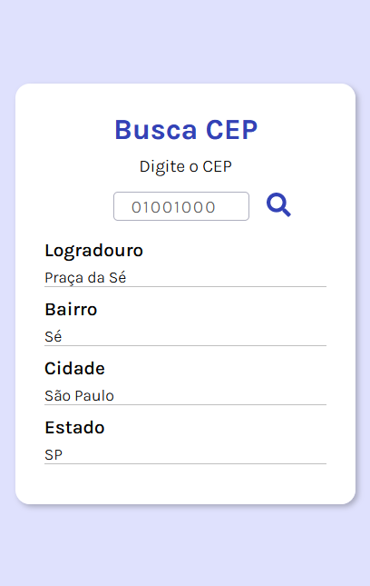

# Busca CEP
Página web onde é possível localizar qualquer endereço através do CEP.

##  Sobre este projeto

Este projeto foi importante para o entendimento de como os valores (propriedades) são passadas entre componentes. Também aprendi sobre o uso da dependência react-icons que nos permite usar ícones.  

>Tecnologias utilizadas 

ReactJS, reac-icons, API

>Funcionalidades

Faz chamadas a API viaCep e retorna com os dados de endereço através dos dados informados. 
